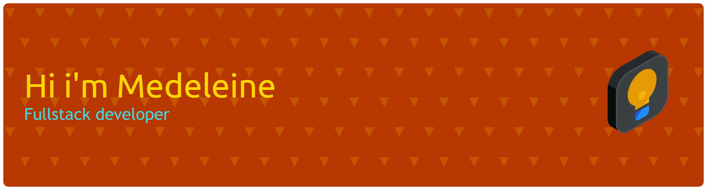

## 💻 Technologies

  

## 🌟 About Me

💻 Fourth-semester Information Technology student at <b>Universitas Sumatera Utara</b>  (GPA <b>3.77/4.00</b>) 
Building intelligent web experiences with Full Stack development and AI 
 
 ✨ What I do:
- 💻 Develop end-to-end web applications
- 🤖 Use AI to boost productivity & problem solving

📚 Always exploring new technologies to work smarter.

## 📊 GitHub Stats

  
  

  

###
<picture>
  <source media="(prefers-color-scheme: dark)" srcset="https://raw.githubusercontent.com/mdln0411/mdln0411/output/pacman-contribution-graph-dark.svg">
  <source media="(prefers-color-scheme: light)" srcset="https://raw.githubusercontent.com/mdln0411/mdln0411/output/pacman-contribution-graph.svg">
  
</picture>

###

  

      
      